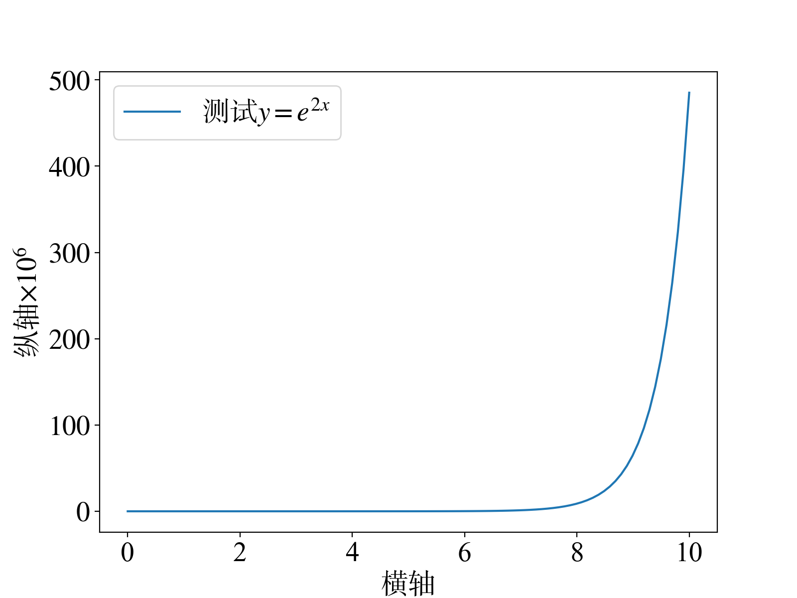
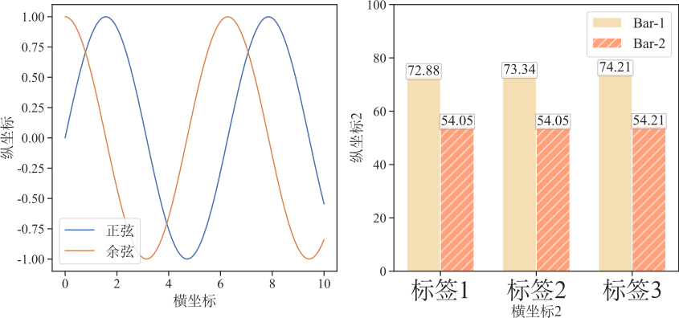

# Matplotlib中文设置

## 单子图
```python
import numpy as np
import matplotlib.pyplot as plt
import os
import seaborn as sns

from matplotlib.ticker import FuncFormatter
from matplotlib.font_manager import FontProperties

# 全局设置
font_size = 20
config = {
    "font.family":'serif',
    "font.size": font_size,
    "mathtext.fontset":'stix'
}
plt.rcParams.update(config)
plt.rcParams['axes.unicode_minus'] = False  # 用来正常显示负号


# 字体设置
zh_font = FontProperties(fname='字体路径.ttf', size=font_size)
font_dict = {
    'fontproperties': zh_font,
    'size': font_size
}

f, ax = plt.subplots(1, 1, figsize=(8, 6), dpi=200)
x = np.linspace(0, 10, 100)
y = np.exp(2*x)

plt.plot(x, y, label='测试$y=e^{2x}$')

plt.legend(loc='best', prop=zh_font)

# plt.subplots_adjust(left=0.102, bottom=0.115, right=0.990, top=0.990, hspace=0.2,wspace=0.2)
plt.xlabel(u'横轴', **font_dict)
plt.ylabel(r'纵轴$\times 10^{6}$', **font_dict)  # 反斜杠有特殊含义 所以用raw string,或者用\\times


def formatnum(x, pos):
    return '$%d$' % (x // 1e6)
formatter = FuncFormatter(formatnum)
ax.yaxis.set_major_formatter(formatter)  # y轴用1e6表示


plt.yticks(**font_dict)  # 自定义字体
plt.xticks(fontproperties='Times New Roman', size=font_size)  # 系统自带字体
plt.show()

# plt.savefig("xxx.tif", bbox_inches='tight', pad_inches=0)
```

<div align=center>

</div>

# 多图 + 坐标刻度设置
```python
import numpy as np
import matplotlib.pyplot as plt
from matplotlib.font_manager import FontProperties
import seaborn as sns

font_size = 18
config = {
    "font.family":'Times New Roman',
    "font.size": font_size,
    "mathtext.fontset":'stix',
    "font.sans-serif": 'SimSun'
}
plt.rcParams.update(config)
plt.rcParams['axes.unicode_minus'] = False  # 用来正常显示负号
# 字体设置
zh_font = FontProperties(fname='simsun.ttf', size=font_size)
zh_font_dict = {
    'fontproperties': zh_font,
    'size': font_size
}
en_font = FontProperties(fname='Times New Roman.ttf', size=font_size)
en_font_dict = {
    'fontproperties': zh_font,
    'size': en_font
}

sns.set_context('paper',font_scale=1.5,rc={"lines.linewidth": 1.7})
sns.set_theme(style="ticks",font='Times New Roman',font_scale=1.5)


fig = plt.figure(figsize=(14, 6))

# 子图1
ax1 = fig.add_subplot(121)
x = np.linspace(0, 10, 100)

ax1.plot(x, np.sin(x), label='正弦')
ax1.plot(x, np.cos(x), label='余弦')
ax1.legend(prop=zh_font)
ax1.set_xlabel('横坐标', **zh_font_dict)
ax1.set_ylabel('纵坐标', **zh_font_dict)


### 子图2
ax2 = fig.add_subplot(122)
labels = [u'标签1', u'标签2', u'标签3']
x = np.arange(len(labels))
width = 0.35
offset = 2.0

# 绘制柱状图
bar1 = [72.88, 73.34, 74.21]
bar2 = [54.05, 54.05, 54.21]
ax2.bar(x - width / 2, bar1, width=width, color='wheat', label='Bar-1')
ax2.bar(x + width / 2, bar2, color='lightsalmon', width=width, hatch='//', label='Bar-2')

# 柱状图 标识数字
for idx, value in enumerate(bar1):
    xx = x[idx] - width / 2
    ax2.text(xx, value + offset, value, bbox=dict(boxstyle="round, pad=0.1", fc="w", ec="0.5", alpha=0.5, ), fontdict=dict(fontsize=font_size), ha='center', va='center')

for idx, value in enumerate(bar2):
    xx = x[idx] + width / 2
    ax2.text(xx, value + offset, value, bbox=dict(boxstyle="Roundtooth, pad=0.1", fc="w", ec="0.5", alpha=0.5, ), fontdict=dict(fontsize=font_size), ha='center', va='center')

ax2.set_xticks(x)
ax2.set_xlabel('横坐标2', **zh_font_dict)

# 可以对每一个横坐标刻度 设置字体属性
labels = ax2.set_xticklabels(labels, **zh_font_dict)
for label in labels:
    label.set_fontproperties(FontProperties(fname='simsun.ttf', size=30))

ax2.set_ylabel('纵坐标2', **zh_font_dict)
ax2.set_ylim([0, 100])

ax2.legend(loc='upper right', prop=en_font)

# plt.show()
plt.savefig('matplotlib2.svg', bbox_inches='tight', pad_inches = 0)
```

<div align=center>

</div>