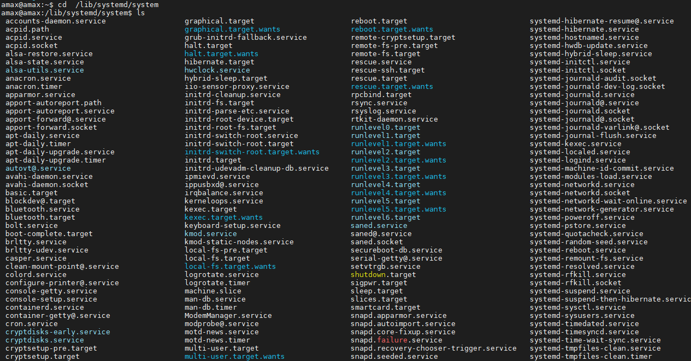
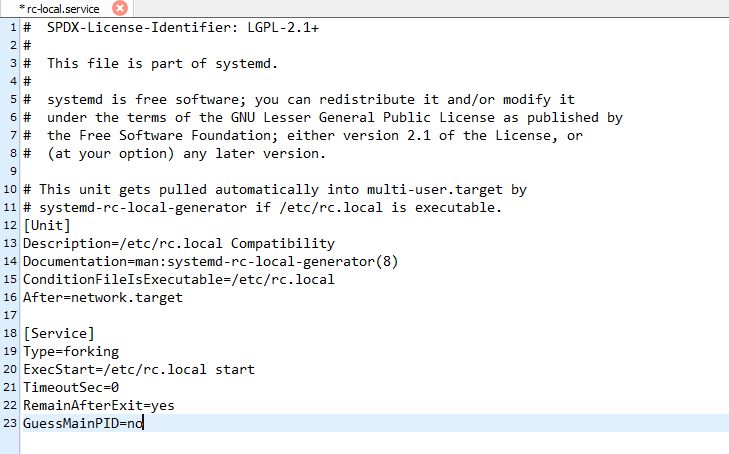
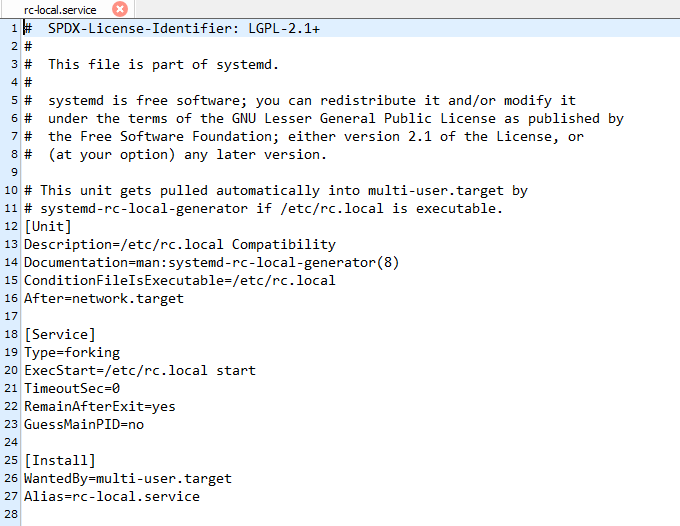

# Ubuntu 程序开机自启动

- 进入`/lib/systemd/system/`目录，这里有许多启动脚本
  ```shell
  cd /lib/systemd/system/
  ```
    <div align=center>
    
    </div>

- 修改`rc-local.service`文件权限
  ```shell
  sudo chmod 777 /lib/systemd/system/rc-local.service
  ```

- 打开并编辑`rc-local.service`文件
  ```shell
  sudo gedit rc-local.service
  ```
  原始内容如下：
    <div align=center>
    
    </div>
  一般启动文件分成三个部分:
  
  - [Unit]段：启动顺序、依赖关系
  
  - [Service]段：启动类型、启动方式
  
  - [Install]段：如何做到开机启动
  原始内容缺少了[Install]段，没有定义如何开机启动，因此我们在该文件后添加[Install]段
  
  ```
  [Install]
  WantedBy=multi-user.target  
  Alias=rc-local.service
  ```
  修改后的内容如下：
    <div align=center>
    
    </div>

- 切换到`/etc/`目录，找到`rc.local`文件，如果没有就创建一个
  ```shell
  cd /etc/
  sudo gedit rc.local
  ```

- 把需要启动的脚本写入`/etc/rc.local`的`exit 0`之前
  ```
  #!/bin/sh
  脚本代码
  exit 0
  ```
  需要注意：
  - 开头一定要写`#!/bin/sh`
  - 如果启动脚本是类似于`sh ./test.sh`类型的，需要使用后台运行的方式，即`sh ./test.sh &`，否则会卡在启动界面无法进入系统

- 修改`rc.local`的权限
  ```shell
  sudo chmod 777 /etc/rc.local
  ```

- systemd默认读取`/etc/systemd/system/`下的配置文件，所以要在`/etc/systemd/system/`目录下创建软链接
  ```shell
  sudo ln -s /lib/systemd/system/rc.local.service /etc/systemd/system/
  ```

- 重启系统，测试是否成功