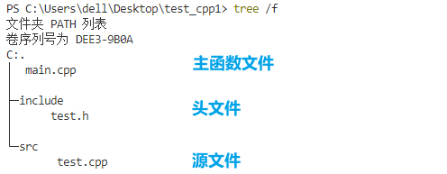
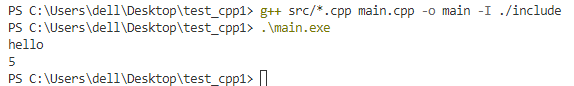
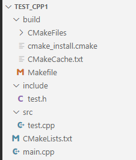

# Windows上VSCode配置C/C++ cmake环境

## 1. MinGW安装

- 首先安装MinGW，这里提供离线安装链接[https://sourceforge.net/projects/mingw-w64/files/](https://sourceforge.net/projects/mingw-w64/files/)，推荐选择最新版本的`x86_64-posix-seh`安装包
- 将压缩包解压后，在环境变量中添加`<MinGW-path>/bin`目录
- 在cmd命令行中输入`gcc -v`或者`g++ -v`指令，如果提示已经安装的mingw的版本，则说明安装成功

## 2. Cmake安装
- 安装cmake，下载链接[https://cmake.org/download/](https://cmake.org/download/)
- 在环境变量中添加`<cmake-path>/bin`目录
- 在cmd命令行中输入`cmake --version`指令，如果提示了cmake的版本，则说明安装成功

## 3. VSCode插件安装
- 要安装三个插件: `C/C++`,`CMake`,`CMake Tools`
- 然后将`C/C++`版本退回到**1.8.4**版本，否则无法自动生成vscode的`launch.json`以及`task.json`

## 4. 多源文件编译

- 新建项目，项目目录如下

<div align=center>

</div>

`main.cpp`中代码如下：

```c++
# main.cpp
#include <iostream>
#include "test.h"

using namespace std;

int main()
{
    int a = 3, b = 2;
    cout << "hello" << endl;

    cout << func(a, b) << endl;
    return 0;
}
```

`test.h`中代码如下：

```c++
int func(int a, int b);
```

`test.cpp`中代码如下：

```c++
#include "test.h"

int func(int a, int b)
{
    return a + b;
}
```

### 4.1 使用g++编译

此时若使用g++编译，只需要在终端中输入以下指令，即可在当前目录中生成`main.exe`(文件名成由`-o`指定)

```terminal
g++ src/*.cpp main.cpp -o main -I ./include
```

然后输入以下指令执行exe文件

```
.\main.exe
```

<div align=center>

</div>

### 4.2 使用CMake编译

- 首先在工作区目录中添加一个cmake文件`CMakeLists.txt`

    ```cmake
    # CMakeLists.txt
    
    project(MyCPPTest)
    aux_source_directory(src SRC_DIR)
    aux_source_directory(. SRC_CUR_DIR)
    add_executable(main ${SRC_DIR} ${SRC_CUR_DIR})
    include_directories(include)
    ```


    - `project() `：设置项目名称，参数可以随意指定
    - `aux_source_directory(dir VAR)`: 搜索 dir 目录下所有的源文件，并将结果列表存储在变量 VAR 中
    - `add_executable(target src)`: 指定使用源文件 src，生成可执行程序 target , `${变量名}` 是取变量的值
    - `include_directories(headDir)`: 设置包含的头文件目录

- 在vscode中配置cmake，按快捷键`ctrl+shift+p`，搜索`CMake configure`，在弹出的窗口中选择MinGW的GCC编译器，配置完成后会在vscode工作区生成一个`build`目录，在终端中执行指令，`mingw32-make.exe`应该看`MinGW/bin`目录下有什么exe文件，主要是看安装的32位还是64位

  ```terminal
  cd build
  cmake ..
  mingw32-make.exe
  ```
  
- 如果上一步cmake配置出错，那就

    ```terminal
mkdir build
cd build
cmake -G “MinGW Makefiles” ..
mingw32-make.exe
    ```
  
  - 如果没有`build`目录自动生成出来，可以使用`cmake -G “MinGW Makefiles” ..`来代替`cmake ..`指令，当然这只需要执行一次，以后就直接用`cmake ..`即可

  通过cmake生成出来的文件.

  <div align=center>
  
  </div>

## 5 多文件调试

- 首先文件标签切换到一个源文件上,而不是CMakeLists.txt文件

- 在侧边栏中创建`launch.json`和`tasks.json`文件, 如果没创建出来,可以自己在工作区创建一个目录`.vscode`,目录下面新建两个json文件

  ```json
  # launch.json
  {
      // 使用 IntelliSense 了解相关属性。 
      // 悬停以查看现有属性的描述。
      // 欲了解更多信息，请访问: https://go.microsoft.com/fwlink/?linkid=830387
      "version": "0.2.0",
      "configurations": [
          {
              "name": "g++.exe - 生成和调试活动文件",
              "type": "cppdbg",
              "request": "launch",
              // "program": "${fileDirname}\\${fileBasenameNoExtension}.exe",
              "program": "${workspaceFolder}\\build\\main.exe",  // CMake, 与tasks.json的cwd参数对应
              "args": [],
              "stopAtEntry": false,
              "cwd": "${fileDirname}",
              "environment": [],
              "externalConsole": false,
              "MIMode": "gdb",
              "miDebuggerPath": "D:\\mingw64\\bin\\gdb.exe",
              "setupCommands": [
                  {
                      "description": "为 gdb 启用整齐打印",
                      "text": "-enable-pretty-printing",
                      "ignoreFailures": true
                  },
                  {
                      "description": "将反汇编风格设置为 Intel",
                      "text": "-gdb-set disassembly-flavor intel",
                      "ignoreFailures": true
                  }
              ],
              "preLaunchTask":"cmake build"  // Cmake, 与tasks.json的最后一个task的label对应
          }
      ]
  }
  ```

  - `program`: 要调试的可执行程序的路径，里边可以使用一些宏，宏的外部加 `${}` 表示取值
  - `${fileDirname}`：文件目录的名字
  - `launch.json` 对应的目录名就是 `.vscode`
  - `${fileBasenameNoExtension}`：不带扩展名的文件名，文件名是 main 函数对应的那个文件
  - `${workspaceFolder}`：工作区目录
  - `preLaunchTask`：调试项目前要执行的任务，C/C++: g++.exe 生成活动文件是 tasks.json 中的一个任务
  - 通过执行这个任务生成了 program 对应的可执行文件

  tasks.json文件替换成这样

  ```json
  # tasks.json
  {
      "version": "2.0.0",
      "options": {
          "cwd": "${workspaceFolder}/build/"
      },
      "tasks": [
          {
              "label": "cmake",
              "type": "shell",
              "command": "cmake",
              "args": [
                  ".."
              ]
          },
          {
              "label": "make",
              "group":{
                  "kind":"build",
                  "isDefault":true
              },
              "command": "mingw32-make.exe",
              "args":[
              ]
          },
          {
              "label":"cmake build",
              "dependsOn":[
                  "cmake",
                  "make"                
              ]
          }
      ]
  }
  ```

  

