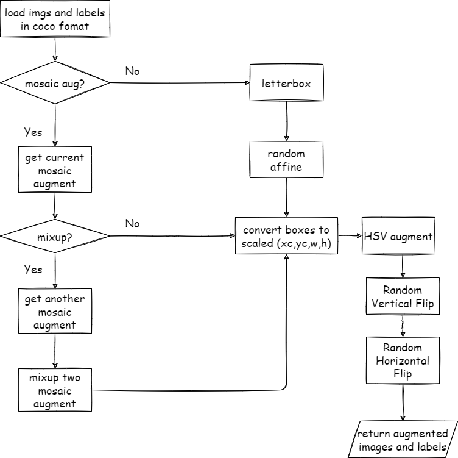

# YOLO V6

代码仓库链接 [meituan/YOLOv6: YOLOv6: a single-stage object detection framework dedicated to industrial applications. (github.com)](https://github.com/meituan/YOLOv6)

## Augmentation
### 1. HSV Augment

- 作用：颜色增强与人类视觉接近的前提下，改变颜色域
- 输入
  - uint8的BGR的图片
  - HSV三个通道的增益系数：`hgain`, `sgain`, `vgain`, 默认都是0.5
- 增强过程
  - BGR->HSV，拆分为三个通道，分别是H、S、V三通道矩阵
  - 随机产生3个[-1，1）系数，与三个gain系数相乘后加1，得到随机的增益系数
  - 使用随机增益系数，构造HSV三通道的查找表(从H、S、V映射到LUT中的HSV)
  - 将映射后的LUT HSV在通道方向拼接，再HSV->BGR
- 输出
  - 增强后的uint8的BGR图片

### 2. LetterBox

- 作用：保持原图的宽高比，在短边方向上进行填充，使输入网络的张量为正方形
- 输入
  - uint8的BGR的图片
  - new_shape: 输出的shape，要求是正方形
  - 填充的三通道的颜色
- 增强过程
  - 先获得输入图片的shape，计算new_shape与shape的最小放缩比例
  - 计算缩放后的图片尺寸，并分别计算宽高的padding大小
  - 宽高方向的padding各取一半，得到四个方向上的填充大小
  - 使用`cv2.copyMakeBorder`进行颜色值的填充
- 输出
  - resize后的图片

### 3. Mixup

- 作用：两张图片空间域上的加权融合
- 输入
  - uint8的BGR的image1
  - image1对应的labels：[box1,box2...boxm]
  - uint8的BGR的image2
  - image2对应的labels：[boxa,boxb...boxn]
- 增强过程
  - 随机生成mixup比率系数
  - 把image1和image2通过比率系数pixel-wise融合
  - labels直接进行拼接[box1,box2...boxm,boxa,boxb...boxn]
- 输出
  - 融合后的图片
  - 拼接后的labels

### 4. Random Affine

- 作用：对图片进行仿射变换
- 输入
  - uint8的BGR的图片
  - 仿射变换的参数
- 增强过程
  - 先通过仿射变换参数，生成变换矩阵
  - 对输入图片进行放射变换，并对边界进行值填充
  - 如果图片有box，对box的坐标也要做变换
- 输入
  - 仿射变换后的uint8 BGR图片
  - 仿射变换后的labels

### 5. Mosaic Augment

- 作用：把四张BGR图片空间方向合成一张大图片

- 输入

  - 四张uint8的BGR图片
  - 四种图片对应的labels

- 增强过程

  - 先随机选取大图片中的拆分点，根据拆分点将四张图片分别嵌入进去
  - 对于每一张小图片，都要计算切分位置，嵌入到大图中
  - 每一个小图片的labels，转换成x1y1x2y2格式，同时scale到原图比例，而不是0~1之间
  - 最后把所有labels相对于大图做clip （这里感觉有点问题，应该是每一个图的labels对嵌入进去的小图做clip才对，不知道其他的mosaic到底是怎么做的）
  - 仿射变换到正确训练的尺寸
- 输出
  - 合成后的uint8 BGR图片
  - 合成后的labels

## DataSet

## Model

- Backbone：
  - EfficientRep，无残差结构，不确定是否有梯度消失的现象。训练结束后，测试阶段，将卷积、BN、ReLU进行层融合，推理会更快。
  - SimSPPF，多感受野特征融合，级联的Maxpool加残差结构，结构类似Inception块，但实际功能是动态的增加感受野大小，而且最后是拼接特征，即不同感受野的特征均保留。
- Neck：RepPAN，将Backbone的最后三个RepBlock的特征，进行PAN多尺度特征提取。在大尺寸特征图上实现对小目标的检测，小目标很容易受到噪声影响，所以FPN使用高级语义信息来增强浅层的类别信息，保留细节信息。然后用浅层的细节信息，去加强深层小尺寸特征图的细节，实现准确的定位。
- Head：每个anchor生成80+4+1个通道，分别表示80个类别+4个回归参数+1个objectness置信度

## **Loss Function**

- 定位损失：5 * CIOU + L1 loss
- 置信度损失：BCE loss
- 分类损失： BCE loss

两个BCE loss和YOLO v3基本保持一致，期望一个anchor可对多种类别的物体做分类，不像softmax一样多类别是互斥的关系。

CIOU损失在YOLO3 SPP时也已经存在了，仓库中还提供了SIOU loss的实现。

没太理解的是L1定位损失。一般像Faster RCNN系列、SSD系列都是采用Smooth L1，期望在回归误差较小时，能够得到平滑的梯度，而且零点处可导。希望各位前辈可以解惑。

## 总结

YOLOv6的代码结构确实是不够清晰，不过也有优点，比如对于trick的列举，在未来使用trick时比较方便。而且在开源时，将部署的工作做的比较完善。

在本文分析的过程中，花了大量时间和经历绘制网络结构图，目的是希望能对各个模块有基本认知，但在损失函数部分一笔带过，这是不可取的，目标检测最吸引人的地方就是损失函数部分，只是这个代码确实难懂。